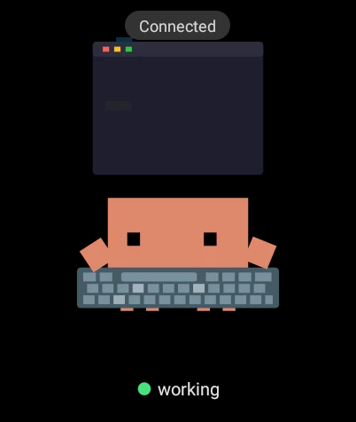

<p align="center">
  
</p>
<h1 align="center">Clawd on Watch</h1>
<p align="center">
  <strong>Desktop Pet + Wear OS Companion</strong><br>
  <sub>Forked from <a href="https://github.com/rullerzhou-afk/clawd-on-desk">clawd-on-desk</a> by <a href="https://github.com/rullerzhou-afk">@rullerzhou-afk</a></sub>
</p>
<p align="center">
  <a href="README.zh-CN.md">中文版</a>
  ·
  <a href="README.zh-TW.md">繁體中文</a>
  ·
  <a href="README.ko-KR.md">한국어</a>
  ·
  <a href="README.ja-JP.md">日本語</a>
</p>
<p align="center">
  
</p>

<p align="center">
  
  &nbsp;&nbsp;&nbsp;&nbsp;
  
</p>

## What is Clawd on Watch?

**Clawd on Watch** extends the [clawd-on-desk](https://github.com/rullerzhou-afk/clawd-on-desk) desktop pet with a **Wear OS smartwatch companion**. The pixel crab lives on both your desktop and your wrist — when your AI coding agent starts thinking, typing, or juggling subagents, the watch mirrors the state in real time over Bluetooth Low Energy (BLE).

Walk away from your desk, glance at your wrist, and know instantly whether your agent is still working, waiting for permission, or done. When the agent needs to run a risky command, the watch vibrates and lets you **approve or deny with a wrist flick** — no need to rush back to the terminal.

> The desktop side retains all features from upstream clawd-on-desk: 14 animated states, permission bubbles, session dashboards, custom themes, multi-display support, and integrations with **Claude Code**, **Codex CLI**, **Copilot CLI**, **Gemini CLI**, **Cursor Agent**, and [many more](#desktop-features).

---

## Watch Companion

### How It Works

```
Desktop (Electron)                Watch (Wear OS / Kotlin)
  src/main.js                       watch-app/android/
  src/watch-adapter.js              service/BleService.kt
  src/watch-controller.js           renderer/PetView.kt
       │                            domain/ThemeReceiver.kt
       │ stdio JSON
       ▼
  scripts/watch_buddy_bridge.py     (BLE Central, Python bleak)
       │
       │ GATT over BLE
       ▼
  ┌─────────────────────────────────────────────────────┐
  │  CWD1: State + Theme frames     Desktop → Watch     │
  │  CWD2: Approval Request         Desktop → Watch     │
  │  CWD3: Approval Response        Watch → Desktop     │
  │  CWD4: Meta + themeHash         Watch → Desktop     │
  └─────────────────────────────────────────────────────┘
```

The desktop spawns a Python sidecar (`watch_buddy_bridge.py`) that acts as a BLE Central. The watch runs as a BLE Peripheral (GATT Server). State snapshots, theme data, and permission requests flow over custom GATT characteristics.

### Watch Features

#### Real-time State Sync
The watch mirrors the desktop pet's state over BLE, with 14 distinct animations: idle, thinking, typing, building, headphones groove (1 subagent), juggling (2+ subagents), error, happy, notification, sweeping, carrying, sleeping, and more. A color-coded chip at the bottom shows the current state. Each state transition triggers a short haptic vibration.

#### Theme Sync over BLE
Custom themes are automatically pushed from the desktop to the watch. SVG animation files are chunked and transferred over BLE, then rendered on-device via an invisible WebView that captures CSS animations frame-by-frame into cached WebP sequences. The watch uses a SHA-256 fingerprint to detect stale themes and only syncs when needed.

#### Permission Approval from Your Wrist
When your AI agent requests permission to run a tool or command, the watch vibrates with risk-differentiated haptic patterns:
- **High risk**: triple pulse, gesture disabled — buttons only
- **Medium risk**: double pulse
- **Low risk**: single short pulse

Three input methods:
1. **Buttons**: Deny / Allow / Always Allow
2. **Wrist flick**: flick to approve, shake to deny (disabled for high-risk)
3. **Timeout**: auto-denies if the screen turns off or the timer expires

#### Auto-reconnect & Power Management
The BLE connection automatically recovers from disconnects with progressive retry delays. A 30-second watchdog detects silent Central disappearances. The watch pauses animations and gesture detection when the screen is off to save battery.

### Watch Demo

<p align="center">
  
  <br>
  <sub>Clawd on a Wear OS watch — "Connected" with the crab typing away while the agent works</sub>
</p>

### Setup Guide

#### Prerequisites

| Component | Requirement |
|-----------|------------|
| Watch | Wear OS device with BLE support |
| Desktop | macOS (tested), Windows/Linux (experimental) |
| Python | Python 3.8+ with `bleak` library |
| Android SDK | compileSdk 34, JDK 17 |

#### 1. Desktop: Enable Watch Mode

1. Launch Clawd and open **Settings** (right-click or tray menu)
2. Navigate to the **Remote Approval** tab (airplane icon in sidebar)
3. Expand the **Watch** card
4. Toggle **"Enable"** ON — this starts the BLE bridge sidecar in the background
5. Click **"Scan"** — nearby Wear OS devices will appear as a list
6. Click your watch from the device list — the desktop connects automatically
7. Once connected, status shows **"Connected: \<device name\>"**
8. Optionally, toggle **"Approval on Watch"** ON to forward tool-permission requests to the watch

> If the bridge reports `missing_bleak`, click the **"Install bleak"** button in the error hint — it runs `pip install bleak` for you.

**Shortcut for returning users**: If you've connected before, the device address is saved. After enabling, click **"Reconnect"** to skip scanning.

<details>
<summary>Advanced: environment variable overrides (for development/CI)</summary>

```bash
export CLAWD_WATCH_ENABLED=1                      # force-enable (overrides Settings)
export CLAWD_WATCH_ADDRESS="<ble-address>"         # BLE address (macOS UUID format)
export CLAWD_WATCH_NAME_PREFIX="Clawd"             # scan name prefix
export CLAWD_WATCH_PYTHON="python3"                # Python executable
```

</details>

#### 2. Watch: Build & Install

```bash
cd watch-app/android

# Set environment
export ANDROID_HOME=~/Library/Android/sdk
export JAVA_HOME=/path/to/jdk17   # JDK 17 required (Gradle 8.2)

# Build
./gradlew assembleDebug

# Install to watch (connect via ADB)
adb install -r -d app/build/outputs/apk/debug/app-debug.apk
```

#### 3. Pair & Connect

1. Launch the watch app — it enters pairing mode and begins BLE advertising
2. Start the desktop app with `CLAWD_WATCH_ENABLED=1`
3. The desktop scans for nearby BLE peripherals with the "Clawd" prefix
4. Once connected, the watch shows "Connected" and the pet starts syncing states
5. If the desktop has a custom theme, it auto-syncs to the watch on first connection

#### 4. Verify

```bash
# Watch logs
adb logcat -s PetView FrameRecorder ThemeConfig BleService

# Look for:
# BleService: Central connected
# ThemeReceiver: assembled: clawd (8399a0)
# PetView: setState → WORKING
```

---

## Desktop Features

> All features from upstream [clawd-on-desk](https://github.com/rullerzhou-afk/clawd-on-desk) are included. Below is a summary.

### Agent Integrations

| Agent | Integration | Permission Bubbles |
|-------|------------|-------------------|
| Claude Code | Command hooks + HTTP permission hooks | Yes |
| Codex CLI | Official hooks + JSONL fallback | Yes |
| Copilot CLI | Command hooks | No |
| Gemini CLI | Command hooks (auto-registered) | No |
| Cursor Agent | IDE hooks (auto-registered) | No |
| Antigravity CLI | Command hooks (state-only) | No |
| CodeBuddy | Command hooks + HTTP permission hooks | Yes |
| Kiro CLI | Custom agent configs | No |
| Kimi Code CLI | Command hooks via TOML | No |
| Qwen Code | Command hooks + permission requests | Yes |
| opencode | Plugin integration | Yes |
| Pi | Global extension (state-only) | No |
| OpenClaw | Plugin integration (state-only) | No |
| Hermes Agent | Plugin integration | No |

### Animations

<table>
  <tr>
    <td align="center"><br><sub>Idle</sub></td>
    <td align="center"><br><sub>Thinking</sub></td>
    <td align="center"><br><sub>Typing</sub></td>
    <td align="center"><br><sub>Building</sub></td>
    <td align="center"><br><sub>1 Subagent</sub></td>
    <td align="center"><br><sub>2+ Subagents</sub></td>
  </tr>
  <tr>
    <td align="center"><br><sub>Calico Idle</sub></td>
    <td align="center"><br><sub>Calico Thinking</sub></td>
    <td align="center"><br><sub>Calico Typing</sub></td>
    <td align="center"><br><sub>Calico Building</sub></td>
    <td align="center"><br><sub>Calico Juggling</sub></td>
    <td align="center"><br><sub>Calico Conducting</sub></td>
  </tr>
  <tr>
    <td align="center"><br><sub>Cloudling Idle</sub></td>
    <td align="center"><br><sub>Cloudling Thinking</sub></td>
    <td align="center"><br><sub>Cloudling Typing</sub></td>
    <td align="center"><br><sub>Cloudling Building</sub></td>
    <td align="center"><br><sub>Cloudling Juggling</sub></td>
    <td align="center"><br><sub>Cloudling Conducting</sub></td>
  </tr>
</table>

### Other Desktop Features

- **Permission bubbles** — floating cards for in-app permission review with Allow / Deny / Always Allow and global hotkeys (`Ctrl+Shift+Y` / `Ctrl+Shift+N`)
- **Session dashboard + HUD** — inspect live sessions, recent events, and jump to terminals
- **Custom themes** — create your own character with SVG/GIF/APNG assets, or import Codex Pet zip packages
- **Multi-display** — proportional sizing, portrait monitor boost, drag across displays
- **Mini mode** — hide at screen edge with peek-on-hover
- **Eye tracking** — Clawd follows your cursor in idle state
- **i18n** — English, Simplified Chinese, Traditional Chinese, Korean, Japanese
- **Auto-update** — checks GitHub releases for new versions

Full feature documentation: **[docs/guides/state-mapping.md](docs/guides/state-mapping.md)** | **[docs/guides/setup-guide.md](docs/guides/setup-guide.md)** | **[docs/guides/known-limitations.md](docs/guides/known-limitations.md)**

### Quick Start (Desktop Only)

```bash
git clone https://github.com/happyomg/clawd-on-watch.git
cd clawd-on-watch
npm install
npm start
```

---

## Fork History

This project is forked from [**clawd-on-desk**](https://github.com/rullerzhou-afk/clawd-on-desk) by [@rullerzhou-afk](https://github.com/rullerzhou-afk) (鹿鹿). The upstream project is a community-driven Electron desktop pet that reacts to AI coding agents in real time.

**What we added:**
- Wear OS companion app (`watch-app/android/`) — full Kotlin implementation with BLE peripheral, SVG animation rendering, and wrist gesture recognition
- Python BLE bridge (`scripts/watch_buddy_bridge.py`) — asyncio + bleak for macOS/Windows/Linux Central connectivity
- Desktop watch adapter (`src/watch-adapter.js`, `src/watch-controller.js`, `src/watch-sidecar-client.js`) — orchestrates sidecar lifecycle, state push, theme sync, and permission relay
- Theme transfer protocol — chunked SVG-over-BLE with SHA-256 fingerprinting for incremental sync

### Syncing with Upstream

The `upstream` remote is already configured. To pull in new features or fixes from the original clawd-on-desk:

```bash
git fetch upstream
git checkout main
git merge upstream/main
# resolve conflicts if any, then:
git push origin main
```

**Likely conflict spots**: `README*.md`, `package.json`, `src/main.js` (watch adapter init lives here). Our watch-exclusive files (`watch-app/`, `scripts/watch_buddy_bridge.py`, `src/watch-*.js`) won't conflict since they don't exist upstream.

## Contributing

Bug reports, feature ideas, and pull requests are welcome — open an [issue](https://github.com/happyomg/clawd-on-watch/issues) or submit a PR directly.

### Upstream Maintainers

<table>
  <tr>
    <td align="center" valign="top" width="140"><a href="https://github.com/rullerzhou-afk"><br /><sub><b>@rullerzhou-afk</b><br />鹿鹿 · creator</sub></a></td>
    <td align="center" valign="top" width="140"><a href="https://github.com/YOIMIYA66"><br /><sub><b>@YOIMIYA66</b><br />maintainer</sub></a></td>
  </tr>
</table>

### Contributors

Thanks to everyone who has helped make Clawd better:

<details>
<summary>Show all 50 contributors</summary>

<table>
  <tr>
    <td align="center" valign="top" width="110"><a href="https://github.com/PixelCookie-zyf"><br /><sub>PixelCookie-zyf</sub></a></td>
    <td align="center" valign="top" width="110"><a href="https://github.com/yujiachen-y"><br /><sub>yujiachen-y</sub></a></td>
    <td align="center" valign="top" width="110"><a href="https://github.com/AooooooZzzz"><br /><sub>AooooooZzzz</sub></a></td>
    <td align="center" valign="top" width="110"><a href="https://github.com/purefkh"><br /><sub>purefkh</sub></a></td>
    <td align="center" valign="top" width="110"><a href="https://github.com/Tobeabellwether"><br /><sub>Tobeabellwether</sub></a></td>
    <td align="center" valign="top" width="110"><a href="https://github.com/Jasonhonghh"><br /><sub>Jasonhonghh</sub></a></td>
    <td align="center" valign="top" width="110"><a href="https://github.com/crashchen"><br /><sub>crashchen</sub></a></td>
  </tr>
  <tr>
    <td align="center" valign="top" width="110"><a href="https://github.com/hongbigtou"><br /><sub>hongbigtou</sub></a></td>
    <td align="center" valign="top" width="110"><a href="https://github.com/InTimmyDate"><br /><sub>InTimmyDate</sub></a></td>
    <td align="center" valign="top" width="110"><a href="https://github.com/NeizhiTouhu"><br /><sub>NeizhiTouhu</sub></a></td>
    <td align="center" valign="top" width="110"><a href="https://github.com/xu3stones-cmd"><br /><sub>xu3stones-cmd</sub></a></td>
    <td align="center" valign="top" width="110"><a href="https://github.com/androidZzT"><br /><sub>androidZzT</sub></a></td>
    <td align="center" valign="top" width="110"><a href="https://github.com/Ye-0413"><br /><sub>Ye-0413</sub></a></td>
    <td align="center" valign="top" width="110"><a href="https://github.com/WanfengzzZ"><br /><sub>WanfengzzZ</sub></a></td>
  </tr>
  <tr>
    <td align="center" valign="top" width="110"><a href="https://github.com/TaoXieSZ"><br /><sub>TaoXieSZ</sub></a></td>
    <td align="center" valign="top" width="110"><a href="https://github.com/ssly"><br /><sub>ssly</sub></a></td>
    <td align="center" valign="top" width="110"><a href="https://github.com/stickycandy"><br /><sub>stickycandy</sub></a></td>
    <td align="center" valign="top" width="110"><a href="https://github.com/Rladmsrl"><br /><sub>Rladmsrl</sub></a></td>
    <td align="center" valign="top" width="110"><a href="https://github.com/YOIMIYA66"><br /><sub>YOIMIYA66</sub></a></td>
    <td align="center" valign="top" width="110"><a href="https://github.com/Kevin7Qi"><br /><sub>Kevin7Qi</sub></a></td>
    <td align="center" valign="top" width="110"><a href="https://github.com/sefuzhou770801-hub"><br /><sub>sefuzhou770801-hub</sub></a></td>
  </tr>
  <tr>
    <td align="center" valign="top" width="110"><a href="https://github.com/Tonic-Jin"><br /><sub>Tonic-Jin</sub></a></td>
    <td align="center" valign="top" width="110"><a href="https://github.com/seoki180"><br /><sub>seoki180</sub></a></td>
    <td align="center" valign="top" width="110"><a href="https://github.com/sophie-haynes"><br /><sub>sophie-haynes</sub></a></td>
    <td align="center" valign="top" width="110"><a href="https://github.com/PeterShanxin"><br /><sub>PeterShanxin</sub></a></td>
    <td align="center" valign="top" width="110"><a href="https://github.com/CHIANGANGSTER"><br /><sub>CHIANGANGSTER</sub></a></td>
    <td align="center" valign="top" width="110"><a href="https://github.com/JaeHyeon-KAIST"><br /><sub>JaeHyeon-KAIST</sub></a></td>
    <td align="center" valign="top" width="110"><a href="https://github.com/hhhzxyhhh"><br /><sub>hhhzxyhhh</sub></a></td>
  </tr>
  <tr>
    <td align="center" valign="top" width="110"><a href="https://github.com/TVpoet"><br /><sub>TVpoet</sub></a></td>
    <td align="center" valign="top" width="110"><a href="https://github.com/zeus6768"><br /><sub>zeus6768</sub></a></td>
    <td align="center" valign="top" width="110"><a href="https://github.com/anhtrinh919"><br /><sub>anhtrinh919</sub></a></td>
    <td align="center" valign="top" width="110"><a href="https://github.com/tomaioo"><br /><sub>tomaioo</sub></a></td>
    <td align="center" valign="top" width="110"><a href="https://github.com/v-avuso"><br /><sub>v-avuso</sub></a></td>
    <td align="center" valign="top" width="110"><a href="https://github.com/livlign"><br /><sub>livlign</sub></a></td>
    <td align="center" valign="top" width="110"><a href="https://github.com/tongguang2"><br /><sub>tongguang2</sub></a></td>
  </tr>
  <tr>
    <td align="center" valign="top" width="110"><a href="https://github.com/Ziy1-Tan"><br /><sub>Ziy1-Tan</sub></a></td>
    <td align="center" valign="top" width="110"><a href="https://github.com/tatsuyanakanogaroinc"><br /><sub>tatsuyanakanogaroinc</sub></a></td>
    <td align="center" valign="top" width="110"><a href="https://github.com/yeonhub"><br /><sub>yeonhub</sub></a></td>
    <td align="center" valign="top" width="110"><a href="https://github.com/joshua-wu"><br /><sub>joshua-wu</sub></a></td>
    <td align="center" valign="top" width="110"><a href="https://github.com/nmsn"><br /><sub>nmsn</sub></a></td>
    <td align="center" valign="top" width="110"><a href="https://github.com/sunnysonx"><br /><sub>sunnysonx</sub></a></td>
    <td align="center" valign="top" width="110"><a href="https://github.com/YuChenYunn"><br /><sub>YuChenYunn</sub></a></td>
  </tr>
  <tr>
    <td align="center" valign="top" width="110"><a href="https://github.com/jhseo-b"><br /><sub>jhseo-b</sub></a></td>
    <td align="center" valign="top" width="110"><a href="https://github.com/Hwasowl"><br /><sub>Hwasowl</sub></a></td>
    <td align="center" valign="top" width="110"><a href="https://github.com/XiangZheng2002"><br /><sub>XiangZheng2002</sub></a></td>
    <td align="center" valign="top" width="110"><a href="https://github.com/keiyo118"><br /><sub>keiyo118</sub></a></td>
    <td align="center" valign="top" width="110"><a href="https://github.com/pan93412"><br /><sub>pan93412</sub></a></td>
    <td align="center" valign="top" width="110"><a href="https://github.com/taehwanis"><br /><sub>taehwanis</sub></a></td>
    <td align="center" valign="top" width="110"><a href="https://github.com/linnin233"><br /><sub>linnin233</sub></a></td>
  </tr>
  <tr>
    <td align="center" valign="top" width="110"><a href="https://github.com/xiyouMc"><br /><sub>xiyouMc</sub></a></td>
  </tr>
</table>

</details>

## Acknowledgments

- Upstream project [clawd-on-desk](https://github.com/rullerzhou-afk/clawd-on-desk) by [@rullerzhou-afk](https://github.com/rullerzhou-afk) (鹿鹿)
- Clawd pixel art reference from [clawd-tank](https://github.com/marciogranzotto/clawd-tank) by [@marciogranzotto](https://github.com/marciogranzotto)
- Shared on [LINUX DO](https://linux.do/) community

## License

Source code is licensed under the [GNU Affero General Public License v3.0](LICENSE) (AGPL-3.0).

**Artwork and bundled theme assets (including `assets/` and `themes/*/assets/`) are NOT covered by AGPL-3.0.** All rights reserved by their respective copyright holders. See [assets/LICENSE](assets/LICENSE) and the notices below for details.

- **Clawd** character is the property of [Anthropic](https://www.anthropic.com). This is an unofficial fan project, not affiliated with or endorsed by Anthropic.
- **Calico cat** artwork by 鹿鹿 ([@rullerzhou-afk](https://github.com/rullerzhou-afk)). All rights reserved.
- **Cloudling** artwork by 鹿鹿 ([@rullerzhou-afk](https://github.com/rullerzhou-afk)). All rights reserved. Cloudling's visual direction includes an homage to the OpenAI Codex logo; Codex/OpenAI marks remain the property of OpenAI, and this project is not affiliated with or endorsed by OpenAI.
- **Third-party contributions**: copyright retained by respective artists.

**No cryptocurrency.** This project has no token, coin, NFT, or airdrop, and is not affiliated with any cryptocurrency project.
